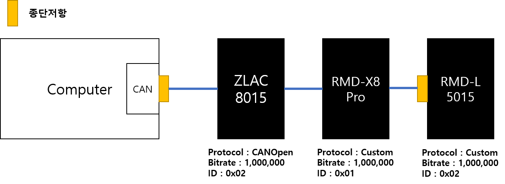
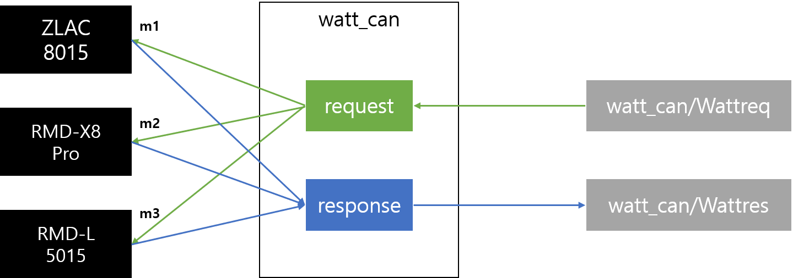

## 하드웨어 세팅



- ZLAC 8015는 기본값으로 CAN 통신 속도가 500,000으로 되어 있습니다. 따라서 연결 전에 따로 Object Dictionary의 [0x200E, 0x00]에 0을 입력해 주어야 합니다.


## 프로그램 작동 방식



- watt_can 노드는 watt_can/Wattreq 메세지를 subscribe 하여 각 드라이버에게 커맨드를 보내고, 돌아온 응답을 모아 watt_can/Wattres 타입의 메세지로 publish 합니다.
- 자세한 내용은 msg 폴더를 참고 바랍니다.

## 프로그램 실행하기

- 본 노드는 socketCAN을 사용합니다. 따라서 프로그램이 실행되기 전에 can이 network interface로 활성화 되어 있어야 합니다.

```
$ sudo ip link set can0 type can bitrate 1000000
$ sudo ifconfig can0 up
$ rosrun watt_can talker
```